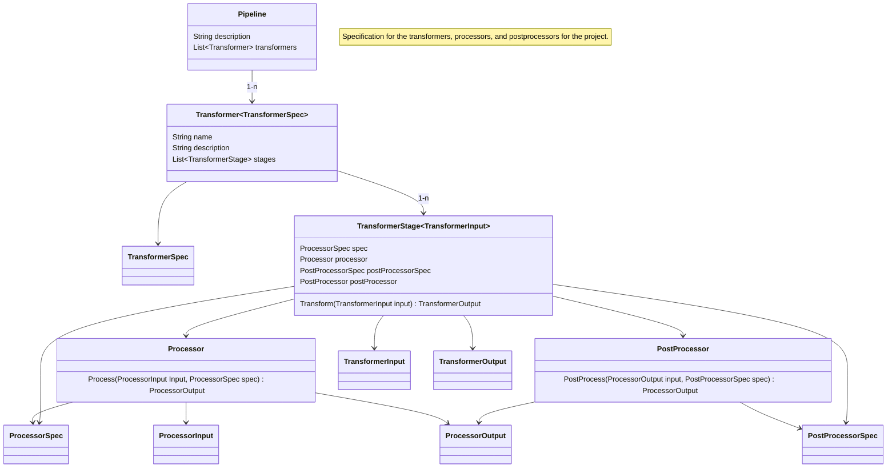

# Specification for the core domain objects of the project

## Project goal
The goal of the projecct is to iteratively design a pipeline that can read in an AD&D 2E modules (in PDF format) and perform a sequence of transformations that ultimately result in the conversion of the material into a Foundry VTT version 13 module using the Pathfinder 2E system.  The overall pipeline needs, at a minimum, the following transformations:
1. Read source PDF and extract data
1. Transform data to formatted HTML saving the output for use during the user feedback stage
1. Validate and verify transformations (automated test)
1. Convert from AD&D 2E Rules to Pathfinder 2E Rules
1. Generate Foundry module 
1. Collect feedback from the user

Each of the stages in the pipeline should target a specific task within the overall conversion.  

The pipeline should be designed for iteration, such that each execution retains knowledge learned from the previous execution in the specifications that are defined in the domain.  The specifications are then fed back into the pipeline on subsequent iterations.  

On the first iteration of the pipeline the specifications will be empty or minimal as a result.

## Domain definitions

- Pipeline - An ordered sequence of transformations

- Transformer - Mutates one data type to another provided a specification for each.  Has multiple stages.  Driven by a transformer specification that details the input, output, and data specifications.

- TransformerSpec - A specification for a Transformer in the pipeline that provides metadata and rules necessary to execute the transformation.  This includes information regarding type conversions, iteration rules, target performance indicators, execution hints, etc.

- TransformerStage - one stage with a transformer.  Bundles a processor, postprocessor, and specification

- Processor - A stage in a transformer.  Performs one isolated unit of work given a data specification, taking an input and producing an output.

- ProcessorSpec - A specification for a specific Processor to provides metadata and rules required for the Processor to function.  Examples are lookup tables for location mapping, text replacement for typos repairs, etc.

- PostProcessor - A stage in a transformer that is attached to a Processor.  Performs secondary post-processing on the output of the Processor, using a specification to produce a final output.  Examples: HTML export, table formatting, validation checks. Current implementation includes HTMLExportPostProcessor for generating styled HTML files.

- PostProcessorSpec - A specification for a specific PostProcessor to provides metadata and rules required for the PostProcessor to function.  Examples are lookup tables for repositioning or reformatting mapping, text replacement, font manipulation, style changes, HTML export configuration, etc. See `docs/chapter_processing_index.md` for chapter-specific postprocessing requirements.

## Domain model

